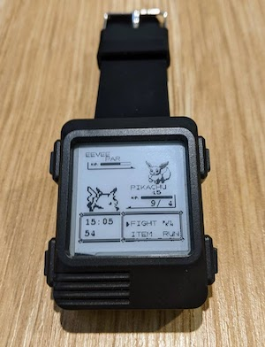

# Pokemon Advance watch face for [Watchy](https://github.com/sqfmi/Watchy)

The original watch face at [examples/WatchFaces/Pokemon/](https://github.com/sqfmi/Watchy/tree/master/examples/WatchFaces/Pokemon) only showed the time. This *Advance* version add the following:
* Step counter (bottom left)
* Battery monitor (Eevee's health)
* Date (day/month format) (below Pikachu's health)



## Build

```
pio run -t upload
```